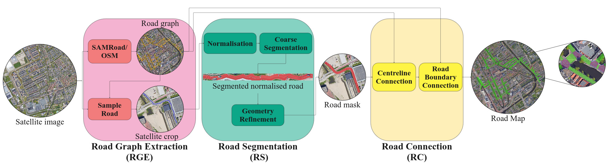

# SAM-Maps: Road Map Generation for Automated Vehicles in European Urban Areas

This repository contains the official implementation of **SAM-Maps**, as described in our paper submitted to **IEEE Intelligent Vehicles Symposium (IV) 2025**.

**SAM-Maps** uses the Segment Anything Model (SAM) and is designed to extract map features such as roads and intersections from aerial imagery. It leverages SAM’s ability to generate high-quality masks from box prompts and applies it to geospatial data, enabling automatic and scalable road map generation in urban areas.

## News
:white_check_mark: Code made public.
:tada: Accepted at IEEE IV 2025.


## Overview
- [Installation](#installation)
- [Method Overview](#method-overview)
- [Configuration](#configuration)
- [Usage](#usage)
- [Citation](#citation)
- [Acknowledgments](#acknowledgments)
- [References](#references)


## Installation

Clone the repository and install the dependencies:

```bash
# TODO: adapt to the public repo, when available
git clone git@gitlab.tudelft.nl:hidde_students/sam-maps.git 
cd sam-maps
git submodule update --init --recursive
conda create -n sam_maps python=3.12 pip
conda activate sam_maps
conda install -c conda-forge gdal
pip install -e .
```

**Install `map_annotation`**:

```bash
cd /path/to/clone/map_annotation/
git clone git@gitlab.tudelft.nl:intelligent-vehicles/map_annotation.git
cd map_annotation
git checkout dev
pip install -e .
```

**Install `segment-geospatial`**:

```bash
cd /path/to/clone/segment_geospatial/
git clone https://github.com/opengeos/segment-geospatial.git
cd segment-geospatial
```
[Optional] In `samgeo/text_sam` change (for control over which GPU to run on):

```diff
--- a/samgeo/text_sam.py
+++ b/samgeo/text_sam.py
@@ -112,7 +112,7 @@ class LangSAM:
     A Language-based Segment-Anything Model (LangSAM) class which combines GroundingDINO and SAM.
     """

-    def __init__(self, model_type="vit_h", checkpoint=None):
+    def __init__(self, model_type="vit_h", checkpoint=None, gpu_id=None):
         """Initialize the LangSAM instance.

         Args:
@@ -123,7 +123,10 @@ class LangSAM:
             checkpoint_url (str, optional): The URL to the checkpoint file. Defaults to None
         """

-        self.device = torch.device("cuda" if torch.cuda.is_available() else "cpu")
+        if gpu_id is None:
+            self.device = torch.device("cuda" if torch.cuda.is_available() else "cpu")
+        else:
+            self.device = torch.device(f"cuda:{gpu_id}" if torch.cuda.is_available() else "cpu")
         self.build_groundingdino()
         self.build_sam(model_type, checkpoint)

```

And then run:


```bash
pip install -e .
```


[Optional] Download the View-of-Delft Prediction dataset to obtain the maps used as ground truth in our experiments: https://intelligent-vehicles.org/datasets/view-of-delft/.   

## Method Overview

*Overview of SAM-Maps, consisting of: The **Road Graph Extraction** (RGE) module, the **Road Segmentation** (RS) and
the **Road Connection** (RC) module.*

### Road Graph Extraction (RGE)
In this module the road graph is predicted. This repository provides a method using OpenStreetMap (OSM) as well as SAM-Road. More information on the RGE-module can be found here: [RGE-module](./src/sam_maps/models/RGE/README.md)
### Road Segmentation (RS)
In this module the drivable area for individual roads is predicted. This repository provides one solution to this problem refered to as `auto_rs`. More information on the RS-module can be found here: [RS-module](./src/sam_maps/models/RS/README.md)
### Road Connection (RC)
In this module the connectivity from the road graph extraction and the drivable area from road segmentation are combined to generate the road map and convert it to a map usable for trajectory forecasting. More information on the RC-module can be found here [RC-module](./src/sam_maps/models/RC/README.md) 

You can freely modify or extend these modules. The pipeline is built in a fully **modular structure**, so it's easy to plug in your own implementations for any of the submodules.


## Configuration

The behavior of the pipeline can be adjusted using configuration files. The main config is:

- `configs/config.yaml`

There are additional configs for each module:
- `configs/rge_module/[module].yaml` (Road Graph Extraction Module)
- `configs/rs_module/[module].yaml` (Road Segmentation Module)
- `configs/rc_module/[module].yaml` (Road Connection Module)

Each parameter can be tuned to control pipeline behavior or to select a different approach. Below is an overview of the most important parameters.

| Config File            | Parameter          | Description                                             | Default                           |
|------------------------|--------------------|---------------------------------------------------------|-----------------------------------|
| `config.yaml`          | `rge_module`                            | Model name of the Road Graph Extraction (RGE) module                   | `samroad` (or `osm_extractor`)  |
| `config.yaml`          | `rs_module`                             | Model name of the Road Segmentation (RS) module                   | `"auto_rs"`                      |
| `config.yaml`          | `rc_module`                             | Model name of the Road Connection (RC) module                  | `"auto_rc"`                   |
| `config.yaml`       | `w_init`       | Initial width selected before the Road Segmentation step, in case no segmentation step is used or no proper segmentation is found, this width will be selected for the road.                        | `4.5 [m]`             |
| `rge_module/samroad.yaml`       | `manual`       | Initial width selected before the Road Segmentation step, in case no segmentation step is used or no proper segmentation is found, this width will be selected for the road.                        | `4.5 [m]`             |
| `rs_module/auto_rs.yaml`      | `rs.roads.box_threshold` | Probability threshold for the bounding box matching for Grounding DINO                        | `0.25`                      |
| `rs_module/auto_rs.yaml`       | `rs.roads.text_threshold`        | Probability threshold for the text prompt matching for Grounding DINO           | `0.25`               |
| `rs_module/auto_rs.yaml`       | `rs.warp_operator.safety_margin_width`         | Safety factor for the cropped region with respect to `w_init` used in the normalisation step (warping) to avoid missing regions from the road in the normalised representation.  | `3.0`          |
| `rs_module/auto_rs.yaml`       | `rs.mask_operator.constraints.min_width`         | Constraint for the minimum width of a proposed road.                    | `4.0 [m]`          |
| `rs_module/auto_rs.yaml`       | `rs.mask_operator.constraints.tree`         | Maximum Intersection over Union (IoU) that the segmentation mask of the road is allowed to have with trespect to the segmentation mask of the trees.                     | `0.05`          |
| `rs_module/auto_rs.yaml`       | `rs.mask_operator.constraints.house`         | Maximum Intersection over Union (IoU) that the segmentation mask of the road is allowed to have with trespect to the segmentation mask of the buildings.                    | `0.05`          |
| `rs_module/auto_rs.yaml`       | `rs.mask_operator.constraints.water`         | Maximum Intersection over Union (IoU) that the segmentation mask of the road is allowed to have with trespect to the segmentation mask of the water.                     | `0.05`          |
| `rs_module/auto_rs.yaml`       | `rs.centerline_extractor.smoothness_factors_spline`         | Smoothness factors used for the centerline extraction. These factors are multiplied with the length of the road to form the smoothness parameter used by `scipy`'s cubic univariate splines.                   | `[0.1, 0.2, 0.5, 1.0, 2.0, 3.5, 5.0, 10.0]`          |

---
Additionally the `configs/config.yaml` includes some flags that can be used for debugging purposes/saving additional intermediate data. 

## Usage

### Generate Maps
Before generating the Road Map, make sure to adapt the configuration files, by selecting the region you want to explore. There are multiple ways of achieving this.

#### OSM-Extractor:
1. Set `area_selection_method` to `"place"` and set `place` to the city/town/village of interest.
2. Set `area_selection_method` to `"bbox"` and set `bbox` to the region of interest. You can include multiple bounding boxes here with the format: `[min_longitude, min_latitude, max_longitude, max_latitude]`
3. Set `area_selection_method` to `"annot_bbox"` This will create a bounding box around that captures the entire area around the given ground truth map. 

#### SAM-Road
1. Set `"bbox"` to the bounding box(es) capturing the region you are interested in.

Once these parameters are set, run the following command.

```bash
python src/generate_map.py
```

If you want to make manual changes to the graph proposed by SAM-Road, make sure to set manual to `True`. If you have manipulated the road graph, add the geojson files of the new graph to `graph.nodes` and `graph.edges` and set manual to `True`. This will ensure that this new graph is used in the rest of the pipeline, rather than trying to find a new road graph using SAM-Road.

### Evaluate Results
This evaluation now evaluates against the View-of-Delft Prediction dataset. If you want to use another ground truth road map (that is annotated in a similar fashion to the VoD-P dataset), adapt `gt_datapath` to the path where this road map is stored.  

```bash
python src/evaluate.py
```

## Citation

If you use this work in your research, please cite our paper:

```
@inproceedings{sam-maps-iv2025,
  title={SAM-Maps: Road Map Generation for Automated Vehicles in European Urban Areas},
  author={Matthijs P. van Andel, Hidde J-H. Boekema, Dariu M. Gavrila},
  booktitle={IEEE Intelligent Vehicles Symposium (IV)},
  year={2025}
}
```

---

## Acknowledgments

This work uses:
- Segment Anything Model (SAM) [1]
- Grounding DINO [2] 
- SAM-Road [3]
- samgeo [4]
- View-of-Delft Prediction dataset [5]

## References

[1] Kirillov, A., Mintun, E., Ravi, N., Mao, H., Rolland, C., Gustafson, L., ... & Girshick, R. (2023). Segment anything. In *Proceedings of the IEEE/CVF international conference on computer vision* (pp. 4015-4026).

[2] Liu, S., Zeng, Z., Ren, T., Li, F., Zhang, H., Yang, J., ... & Zhang, L. (2024, September). Grounding dino: Marrying dino with grounded pre-training for open-set object detection. In *European Conference on Computer Vision* (pp. 38-55). Cham: Springer Nature Switzerland.

[3] Hetang, C., Xue, H., Le, C., Yue, T., Wang, W., & He, Y. (2024). Segment anything model for road network graph extraction. In *Proceedings of the IEEE/CVF Conference on Computer Vision and Pattern Recognition* (pp. 2556-2566).

[4] Wu, Q., & Osco, L. P. (2023). samgeo: A Python package for segmenting geospatial data with the Segment Anything Model (SAM). *Journal of Open Source Software*, 8(89), 5663.

[5] Boekema, H. J., Martens, B. K., Kooij, J. F., & Gavrila, D. M. (2024). Multi-class trajectory prediction in urban traffic using the view-of-delft prediction dataset. *IEEE Robotics and Automation Letters*.
